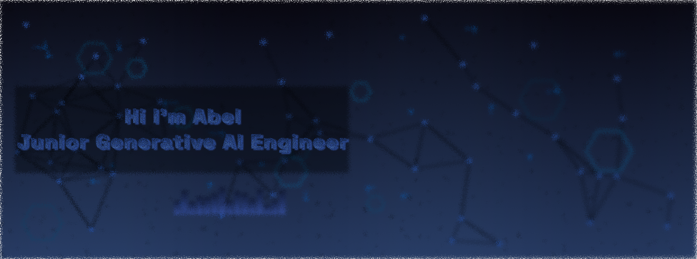

  

  

<h1 align="center">
   
  Hi there, I'm Abel Tamirat
  
</h1>

  
  

---

## 🧑‍💻 About Me

I'm a passionate **Generative AI Engineer** and **Data Scientist** with expertise in building intelligent solutions that bridge the gap between cutting-edge AI research and real-world applications. Currently working at CBE, I specialize in developing enterprise-grade AI systems, RAG architectures, and full-stack ML applications.

- 🔭 **Currently Working On:** Enterprise RAG AI Assistant & Credit Risk Models
- 🌱 **Learning:** Advanced LLM Fine-tuning & MLOps on Kubernetes  
- 👯 **Open for Collaboration:** Generative AI projects and innovative ML solutions
- 💬 **Ask me about:** Python, PyTorch, Hugging Face, RAG systems, ML deployment
- 📫 **Reach me:** abel5173@gmail.com
- ⚡ **Fun fact:** I automate everything that can be automated!

---

## 🎯 What I'm Up To Now

<table align="center">
<tr>
<td width="50%">

### 🚀 Current Projects
- **CBE RAG AI Assistant** - Enterprise conversational AI
- **Credit Risk Modeling** - Advanced ML for financial assessment  
- **LLM Fine-tuning Pipeline** - Custom model optimization
- **AI File Organizer** - Intelligent document classification

</td>
<td width="50%">

### 📈 Focus Areas
- 🤖 Generative AI & Large Language Models
- 🧠 Retrieval-Augmented Generation (RAG)
- 📊 Financial ML & Risk Analytics
- 🔄 MLOps & Production Deployment

</td>
</tr>
</table>

---

## 🛠️ Technical Arsenal

<b>🧠 AI/ML & Data Science</b>

 

<b>🚀 Backend & APIs</b>

 

<b>🎨 Frontend & Full-Stack</b>

 

<b>🗄️ Databases & Storage</b>

 

<b>☁️ DevOps & Cloud</b>

 

---

## 🚀 Featured Projects

<table>
<tr>
<td width="50%">

### 🤖 [CBE RAG AI Assistant](https://github.com/Abel5173/RAG_pipeline)
**Enterprise conversational AI system**
- Built with Python, Hugging Face, FastAPI
- Advanced retrieval-augmented generation
- Production-ready ML pipeline
- Real-time query processing

</td>
<td width="50%">

### 📊 [Fraud Detection System](https://github.com/Abel5173/fraud-detection-app)
**AI-powered financial security**
- Machine learning for anomaly detection
- Real-time transaction monitoring  
- Enterprise-grade accuracy
- Scalable architecture

</td>
</tr>

<tr>
<td width="50%">

### 💳 [Credit Risk Modeling](https://github.com/Abel5173/Credit_Risk)
**Advanced financial risk assessment**
- Sophisticated ML algorithms
- Feature engineering & selection
- Model interpretability
- Production deployment ready

</td>
<td width="50%">

### 📈 [Stock Sentiment Analysis](https://github.com/Abel5173/tenx-stock-sentiment-analysis)
**NLP-powered market insights**
- Real-time sentiment analysis
- Financial news processing
- Market trend prediction
- Interactive visualizations

</td>
</tr>

<tr>
<td width="50%">

### 🤖 [Telegram AI Bot](https://github.com/Abel5173/telegram-bot)
**Intelligent conversational agent**
- Natural language processing
- Multi-function automation
- User interaction optimization
- Scalable bot architecture

</td>
<td width="50%">

### 📁 [ML File Organizer](https://github.com/Abel5173/ml_file_organizer)
**AI-powered file management**
- Intelligent content classification
- Automated organization system
- Machine learning optimization
- User-friendly interface

</td>
</tr>
</table>

---

## 💼 Professional Experience

<table>
<tr>
<td width="33%">

### 🏢 **Data Scientist**
**Commercial Bank of Ethiopia**
- Enterprise AI/ML projects
- Credit scoring systems
- HR chatbot development
- RAG assistant implementation

</td>
<td width="33%">

### 💻 **Freelance ML Engineer**
**Independent**
- Kaggle competition winner
- LLM fine-tuning specialist
- Custom ML solutions
- AI consulting services

</td>
<td width="33%">

### 🚀 **Software Engineer**
**Full-Stack Development**
- AI file organization systems
- Production ML applications
- Telegram bot automation
- End-to-end solutions

</td>
</tr>
</table>

---

## 🏆 Certifications & Achievements

**🎓 Education:** Software Engineering BSc (GPA: 3.69/4.0)

---

## 📊 GitHub Analytics

---

## 🤝 Let's Connect & Collaborate

<table>
<tr>
<td width="33%" align="center">

### 💼 Professional

</td>
<td width="33%" align="center">

### 📧 Contact

</td>
<td width="33%" align="center">

### 🎯 Collaboration

</td>
</tr>
</table>

---

### 💡 *"Building the future with AI, one algorithm at a time"*

**Open for exciting opportunities in Generative AI, ML Engineering, and Data Science!**

